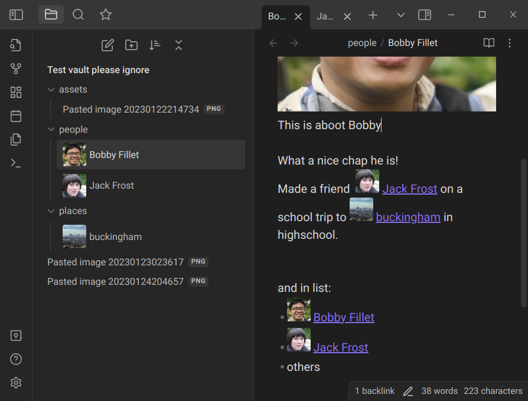

# Obsidian Note Thumbnails

This plugin shows thumbnails in file explorer and in the note itself.

## How it works
Plugin iterates over all markdown files, finds first embed with image extension of each file and then renders small `
` with that image as a background.

## Known issues
- doesn't render thumbnails on startup. Have to change notes for parser to react.
- scans thumbnails only on start, so doesn't handle notes moving or being renamed.
- no thumbnails in search / backlinks / graph

# This plugin is not updated
If you want something added / fixed / uploaded to community plugin repo, do it yourself. Creating this was not particularly easy and from now on it's going to be worse. This is MVP and it's enough for me. 
